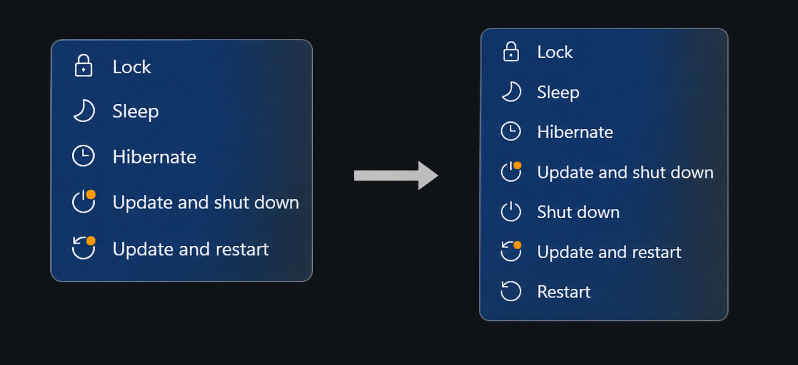

# LetMeShutdown

A very lightweight C++ program that brings back the **Shut down** and **Restart** options to the Start menu when Windows Update would otherwise replace them with **Update and shut down** and **Update and restart**.



## How it works

Windows controls the availability of shutdown and restart options using the `ShutdownFlyoutOptions` `REG_DWORD` value in the registry key `HKEY_LOCAL_MACHINE\SOFTWARE\Microsoft\WindowsUpdate\Orchestrator`.

The value is a 4-bit bitmask. Each bit controls the availability of one option, from the most significant bit to the least significant bit:

| Bit | Option               |
| --- | -------------------- |
| 3   | Update and shut down |
| 2   | Shut down            |
| 1   | Update and restart   |
| 0   | Restart              |

If a bit is set to `1`, the corresponding option is available. If it is set to `0`, the option is unavailable.

Note there is one exception: at least one shutdown option (**Shut down** or **Update and shut down**) and at least one restart option (**Restart** or **Update and restart**) must be available. If both options in either group are disabled, Windows shows the corresponding standard option anyway, regardless of the value of its bit.

Some of the most important values used by Windows are:

- `0b0000` (`0x00`, `0`) — show **Shut down** and **Restart** (no update is waiting to be installed)
- `0b1010` (`0x0A`, `10`) — show **Update and shut down** and **Update and restart**; standard shutdown and restart are disabled
- `0b1111` (`0x0F`, `15`) — show all four options

LetMeShutdown monitors the `ShutdownFlyoutOptions` value and, whenever **Shut down** or **Restart** is disabled, modifies the value to make those options available again.

The program monitors the registry using the Windows API functions `RegNotifyChangeKeyValue` and `WaitForSingleObject`. It waits for registry changes instead of continuously polling the registry, so it uses almost no CPU while idle.

## Usage

### Method 1: Using the installer (recommended)

Download the installer (file name starts with `LetMeShutdown-Setup-`) from the [latest release](https://github.com/bartekl1/LetMeShutdown/releases/latest), run it and follow the instructions.

The installer starts the program and creates a scheduled task that automatically starts it when Windows starts. This method works out of the box and requires no additional configuration.

### Method 2: Using the portable version

Download the portable version (file name starts with `LetMeShutdown-`) from the [latest release](https://github.com/bartekl1/LetMeShutdown/releases/latest). Run the program as administrator.

To start it automatically with Windows, you can create a scheduled task using `taskschd.msc` and configure it to run the program at system startup.

Running the program as a Windows service should also be possible, but I have not tested it. You will probably need a service wrapper like [WinSW](https://github.com/winsw/winsw) or [NSSM](https://nssm.cc/).

The Startup folder (`shell:startup`) and the `HKEY_CURRENT_USER\Software\Microsoft\Windows\CurrentVersion\Run` registry key cannot be used for automatic startup because the program requires administrator privileges.

## Testing (without waiting for update)

1. Run following command as administrator to simulate update availability.

```cmd
reg add "HKEY_LOCAL_MACHINE\SOFTWARE\Microsoft\WindowsUpdate\Orchestrator" /v ShutdownFlyoutOptions /t REG_DWORD /d 0x0a /f
```

2. Check the shutdown options

Open the Start menu and check whether all four shutdown/restart options are available.

You can also check the current value using:

```cmd
reg query "HKEY_LOCAL_MACHINE\SOFTWARE\Microsoft\WindowsUpdate\Orchestrator" /v ShutdownFlyoutOptions
```

Output should contain:

```txt
HKEY_LOCAL_MACHINE\SOFTWARE\Microsoft\WindowsUpdate\Orchestrator
    ShutdownFlyoutOptions    REG_DWORD    0xf
```

3. Run following command as administrator to restore default value:

```cmd
reg add "HKEY_LOCAL_MACHINE\SOFTWARE\Microsoft\WindowsUpdate\Orchestrator" /v ShutdownFlyoutOptions /t REG_DWORD /d 0x00 /f
```

## Prebuilt binaries

Program binaries and installers published in [GitHub Releases](https://github.com/bartekl1/LetMeShutdown/releases) are automatically built using GitHub Actions.

All published files use [GitHub Artifact Attestations](https://docs.github.com/en/actions/concepts/security/artifact-attestations), which can be used to verify their provenance and integrity.

To verify a downloaded file, run the following command (replace `<file>` with the path to the file):

```cmd
gh attestation verify <file> --repo bartekl1/LetMeShutdown
```

> [!NOTE]
> You need [GitHub CLI](https://cli.github.com/) to run this command.

## Building from source

### Program

#### Requirements

- C++ compiler (the project is built and tested with `g++`)

#### Build

```cmd
g++ main.cpp -o LetMeShutdown.exe -mwindows
```

This creates `LetMeShutdown.exe` in the current directory.

### Installer

#### Requirements

- [Inno Setup](https://jrsoftware.org/isinfo.php)
- `LetMeShutdown.exe` file built from source

#### Build

**Using the Inno Setup GUI:**

1. Open `setup.iss` in Inno Setup Compiler.
2. Select **Build → Compile**, or press **Ctrl+F9**.

**Using the command line:**

Run the following command in the project directory:

```cmd
iscc setup.iss
```

> [!NOTE]
> This command assumes that Inno Setup is available in your `PATH` environment variable. Otherwise, use the full path to `ISCC.exe`, for example:
>
> `C:\Program Files (x86)\Inno Setup 6\ISCC.exe`

The installer will be created as `LetMeShutdown-Setup.exe` in the `Output` directory.

## License and disclaimer

This program is licensed under [MIT License](LICENSE).

Use this program at your own risk. The author is not responsible for any damage or data loss caused by using this program.
